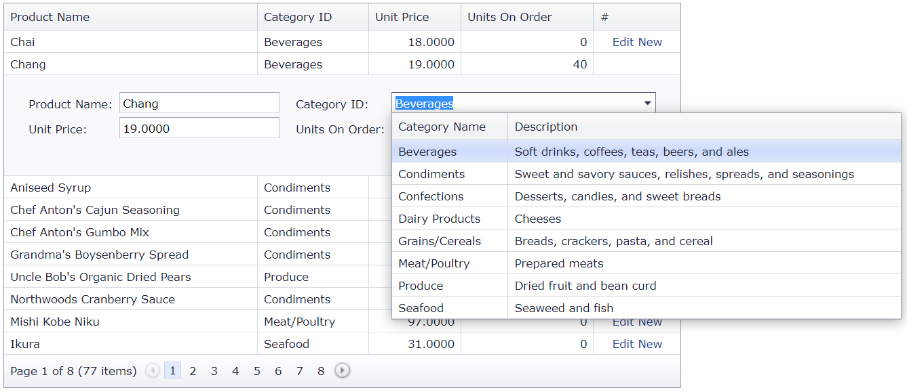

# Grid View for ASP.NET Web Forms - How to use a two-way data-bound grid lookup in the grid's edit form
<!-- run online -->
**[[Run Online]](https://codecentral.devexpress.com/e2979/)**
<!-- run online end -->

This example demonstrates how to create a column edit item template, add a grid lookup control to the template, and use the control's `DataSourceID` property and `Bind` method to bind the control to data sources.



## Overview

Create a combo box column and specify its [EditItemTemplate](https://docs.devexpress.com/AspNet/DevExpress.Web.GridViewDataColumn.EditItemTemplate) property. Add a grid lookup control to the template and use its [DataSourceID](https://docs.devexpress.com/AspNet/DevExpress.Web.ASPxGridLookup.DataSourceID) property to specify the control's data source. Then use the [Bind](https://learn.microsoft.com/en-us/previous-versions/aspnet/ms178366(v=vs.100)#using-the-bind-method) method to bind the control's `Value` property to the corresponding field in the main grid's data source.

```aspx
<dx:GridViewDataComboBoxColumn FieldName="CategoryID" VisibleIndex="1">
    <PropertiesComboBox DataSourceID="dsCategories" TextField="CategoryName" ValueField="CategoryID"
        ValueType="System.Int32">
    </PropertiesComboBox>
    <EditItemTemplate>
        <dx:ASPxGridLookup ID="glCategory" runat="server" AutoGenerateColumns="False" 
            DataSourceID="dsCategories" KeyFieldName="CategoryID" OnLoad="glCategory_Load" 
            TextFormatString="{1}" Value='<%# Bind("CategoryID") %>' Width="260px">
            <GridViewProperties>
                <SettingsBehavior AllowFocusedRow="True" AllowSelectByRowClick="True" 
                    AllowSelectSingleRowOnly="True" />
            </GridViewProperties>
            <Columns>
                <dx:GridViewDataTextColumn FieldName="CategoryID" ReadOnly="True" 
                    Visible="False" VisibleIndex="0">
                    <EditFormSettings Visible="False" />
                </dx:GridViewDataTextColumn>
                <dx:GridViewDataTextColumn FieldName="CategoryName" VisibleIndex="1" />
                <dx:GridViewDataTextColumn FieldName="Description" VisibleIndex="2" />
            </Columns>
        </dx:ASPxGridLookup>
    </EditItemTemplate>
</dx:GridViewDataComboBoxColumn>
```

## Files to Review

* [Default.aspx](./CS/WebSite/Default.aspx) (VB: [Default.aspx](./VB/WebSite/Default.aspx))

## Documentation

* [Data-Binding Expressions Overview](https://learn.microsoft.com/en-us/previous-versions/aspnet/ms178366(v=vs.100))

## More Examples

* [Two-Way Binding](https://demos.devexpress.com/ASPxGridViewDemos/GridEditing/TwoWayBinding.aspx)
